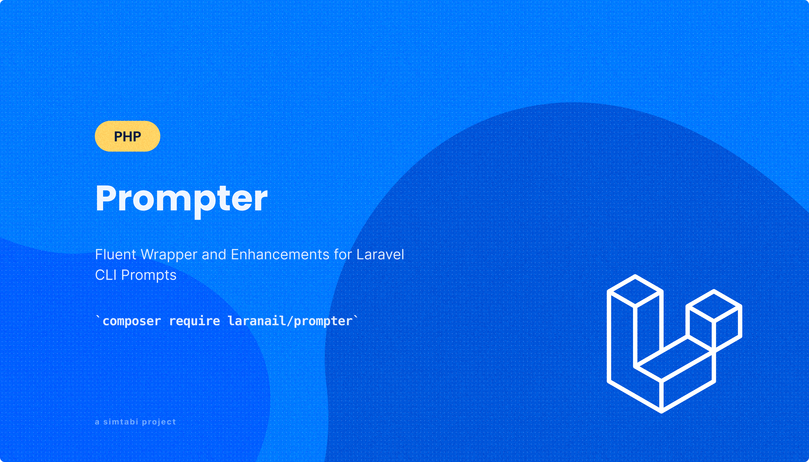

<div align="center">
   
   <br />
</div>

<div align="center">
   <strong>Prompter</strong>
</div>
<div align="center">
<p>
A Laravel package by `simtabi` that extends and adds new functionality to the `laravel/prompts` package, 
<br> providing a fluent API for crafting CLI forms and additional validators.

</p>
</div>
<div align="center">
   <a href="https://simtabi.com">Website</a> 
   <span> · </span>
   <a href="https://github.com/laranail/prompter">GitHub</a> 
   <span> · </span>
   <a href="https://simtabi.com/discord">Discord</a>
</div>

<hr>

## Table of Contents
1. [Introduction](#prompter)
    - [Key Features](#key-features)
    - [Introduction](#introduction)
    - [Getting Started](#getting-started)
    - [Prerequisites](#prerequisites)
    - [Installation](#installation)
    - [Configuration](#configuration)
2. [Usage](docs/usage.md#usage)
    - [Instantiation](docs/usage.md#Instantiation)
    - [Special Functions](docs/usage.md#special-functions)
    - [Building a Form](docs/usage.md#building-a-form)
3. [Validation](docs/validation.md)
3. [Development](#development)
4. [Changelog](#changelog)
5. [Contributing](#contributing)
6. [Security](#security)
7. [Support](#support)
8. [Contributors](#contributors)
9. [Authors](#authors)
10. [License](#license)

<br>

---


## Prompter

`Prompter` is a powerful Laravel package that enhances the functionality, and acts as a fluent wrapper for the `laravel/prompts` CLI package. 
It is designed to make developing CLI applications easier, more robust, and more enjoyable. With `Prompter`, you get:

- A fluent API for crafting complex CLI forms effortlessly.
- An opinionated object-oriented chainable interface.
- Numerous built-in validators to ensure data integrity and security.
- Flexibility to define and use custom validators for specific business logic.

## Key Features

- **Fluent API**: Create complex CLI forms with ease using a fluent, readable, and maintainable API.
- **Validators**: Use built-in validators like `required`, `min`, `max`, `email`, `url`, and `regex`, or create custom validators to meet your specific needs.
- **Chainable Interface**: Enjoy an opinionated object-oriented chainable interface that simplifies CLI development.
- **Extended Functionality**: Adds new functionalities and validators to the existing `laravel/prompts` package.

`Prompter` is perfect for developers looking to build robust CLI applications in Laravel, ensuring a smooth and efficient development process.

## Introduction

This package aims to provide developers with enhanced mechanisms for creating intuitive CLI prompts. Building on the `laravel/prompts` package, it offers a more robust and feature-rich experience.

By extending `laravel/prompts`, this package retains all core features of the original while introducing new functionalities and validators to streamline CLI development. For a comprehensive understanding of the core features and functionalities, 
please refer to the [`laravel/prompts` official documentation](https://laravel.com/docs/prompts). This documentation will focus only on the additional features provided by `Prompter`.

---

## Getting Started

This section will guide you through the initial setup and basic usage of this package, enabling you to quickly start creating intuitive CLI prompts.

---

## Prerequisites

Before installing this package, make sure that your system meets the following requirements:

- PHP >= 8.2.
- Laravel >= 10.x.
- Composer for managing dependencies.


## Installation

Install the Package via Composer by running the following command in your current Laravel project directory:

```bash
composer require --dev laranail/prompter
```

## Configuration
This package does not require any additional configuration. You can start using it right away after installation.

## Usage

Please see [USAGE](./docs/usage.md) guide for more information on how build forms, and use this package.

## Development

#### Install dependencies

```bash
composer install
```

#### Tests
```sh
composer ci
```

<br>
<hr>

## Changelog
Please see [CHANGELOG](./.github/docs/CHANGELOG.md) for more information on what has changed recently.

## Contributing
Please see [CONTRIBUTING](./.github/docs/CONTRIBUTING.md) for details.

## Security
Please see [SECURITY](./.github/docs/SECURITY.md) for details.

## Support
Please see [Support and Community](./.github/docs/SUPPORT.md) for details.

## Contributors
Please see [CONTRIBUTORS](./.github/docs/CONTRIBUTORS.md) for details.

## Authors
- Imani ([@imanimanyara](https://twitter.com/imanimanyara))
- Easter ([@imanimanyara](https://github.com/eastermukora))

## License
Open-sourced software licensed under the MIT license. Please see [LICENSE](./.github/docs/LICENSE) for details.
